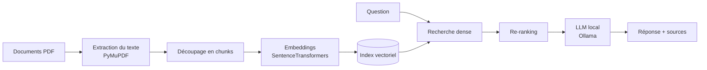

# RAG local : question-réponse sur vos documents

Système de question-réponse basé sur l'architecture **RAG** (*Retrieval-Augmented Generation*), qui fonctionne **entièrement en local** : aucune donnée n'est envoyée vers un service externe. Il permet d'interroger des documents PDF en langage naturel et génère des réponses appuyées sur leur contenu, avec les sources utilisées.


<!-- Ajoute une capture d'écran ou un GIF de l'application ici -->

## Fonctionnalités

- Interrogation de documents PDF en langage naturel
- Recherche dense par embeddings, affinée par un re-ranking
- Génération de la réponse par un LLM exécuté localement via Ollama
- Affichage des passages sources utilisés pour répondre
- Aucune dépendance à une API externe : confidentialité des données garantie

## Architecture



Le système fonctionne en deux phases.

**1. Ingestion et indexation**
Le texte des PDF est extrait avec PyMuPDF, puis découpé en passages (*chunks*) de [X] tokens avec un chevauchement de [X] tokens, afin de conserver le contexte entre deux passages. Chaque passage est ensuite converti en vecteur par le modèle d'embeddings [nom du modèle, ex. all-MiniLM-L6-v2] et stocké dans un index vectoriel.

**2. Recherche et génération**
La question est encodée avec le même modèle, puis comparée à l'index (similarité cosinus) pour récupérer les [X] passages les plus proches. Un modèle de re-ranking [nom du modèle, ex. cross-encoder/ms-marco-MiniLM-L-6-v2] réordonne ces passages pour ne garder que les [X] plus pertinents. Enfin, le LLM [nom du modèle, ex. Mistral 7B] rédige la réponse à partir de ces passages uniquement.

## Technologies

| Rôle | Outil |
|---|---|
| Langage | Python [version] |
| Extraction PDF | PyMuPDF |
| Embeddings et re-ranking | SentenceTransformers, PyTorch |
| Calcul vectoriel | NumPy |
| Exécution du LLM | Ollama ([nom du modèle]) |
| Interface | Streamlit |

## Installation

**Prérequis :** Python [version] et [Ollama](https://ollama.com) installés.

```bash
# Cloner le dépôt
git clone https://github.com/amadou05bah/[nom-du-depot].git
cd [nom-du-depot]

# Installer les dépendances
pip install -r requirements.txt

# Télécharger le modèle de langage
ollama pull [nom du modèle]
```

## Utilisation

```bash
# Placer vos PDF dans le dossier data/, puis lancer l'application
streamlit run app.py
```

## Structure du projet

```
├── app.py              # Interface Streamlit
├── src/
│   ├── ingestion.py    # Extraction et découpage du texte
│   ├── retrieval.py    # Embeddings, recherche et re-ranking
│   └── generation.py   # Appel au LLM via Ollama
├── data/               # Documents à interroger
└── requirements.txt
```
<!-- Adapte cette arborescence à ton vrai projet -->

## Résultats

<!-- Même quelques chiffres simples rendent le projet beaucoup plus crédible -->
- Testé sur [X] documents ([X] pages au total)
- Temps d'indexation : [X] secondes
- Temps de réponse moyen : [X] secondes sur [ta machine, ex. CPU i5, 16 Go RAM]
- Apport du re-ranking : [ex. « réponses correctes sur X questions test sur Y, contre Z sans re-ranking »]

## Limites et améliorations possibles

- Les PDF scannés (images) ne sont pas pris en charge : un OCR serait nécessaire
- [Ajoute les limites que tu as constatées]
- Pistes : base vectorielle persistante (FAISS, ChromaDB), évaluation automatique des réponses, conteneurisation avec Docker

## Auteur

**Amadou Bah** – Étudiant ingénieur Data & IA, INSA Rennes
[LinkedIn](https://www.linkedin.com/in/amadou-bah) · [GitHub](https://github.com/amadou05bah)
